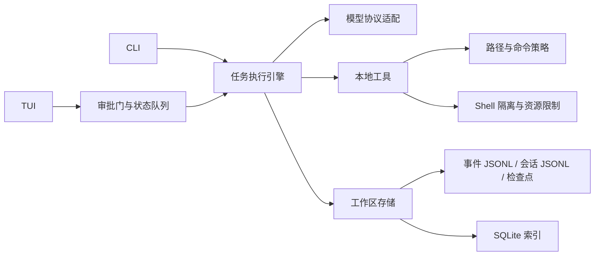

# 程序设计

本文描述 Hyper 0.2.0 当前已实现的结构，以源码为准。使用方法见 [README](../README.md)，后续方向见 [计划](../plan.md) 和 [待办](../todo.md)。

## 目标与边界

Hyper 是本地终端编码代理。它把任务拆成顺序执行的步骤，向模型提供受限工具，记录执行事件，并让运行、会话、差异和检查点可查询。`hyper` 与 `ha` 是同一套 CLI 的两个入口；全屏 TUI 复用执行引擎。

进程内使用 Rust 实现 CLI、任务执行、策略、存储和 TUI。自然语言步骤需要模型服务；以工具前缀开头的步骤可直接执行。npm 包只分发预编译二进制文件。

## 模块图



| 模块 | 职责 |
| --- | --- |
| [`cli.rs`](../src/cli.rs)、[`tui/`](../src/tui/) | 命令解析、交互界面、任务入口、结果展示 |
| [`model.rs`](../src/model.rs) | 任务、步骤、事件、摘要及会话的数据结构和校验 |
| [`engine.rs`](../src/engine.rs) | 步骤调度、工具调用、代理循环、事件写入与 replay |
| [`deepseek.rs`](../src/deepseek.rs)、[`deepseek/stream.rs`](../src/deepseek/stream.rs) | API 配置、协议选择、请求与响应转换、SSE 解析 |
| [`workspace.rs`](../src/workspace.rs) | 文件布局、运行锁、SQLite 索引、会话、清理与检查点 |
| [`policy.rs`](../src/policy.rs)、[`sandbox.rs`](../src/sandbox.rs)、[`resource.rs`](../src/resource.rs) | 命令检查、Linux Landlock、子进程资源限制 |
| [`approval.rs`](../src/approval.rs)、[`event_sink.rs`](../src/event_sink.rs) | TUI 与工作线程之间的审批和状态传递 |
| [`i18n.rs`](../src/i18n.rs) | 界面文案；默认英语，`HYPER_LANG=zh` 或 `zh-CN` 切换中文 |

## 任务与执行流程

`TaskSpec` 包含可选 `id`、`name`、非空的 `steps` 和元数据。每个 `StepSpec` 有唯一 `id`、`mode`（`plan`/`build`）、`instruction`，以及可选的工具白名单、超时和 Shell 资源限制。CLI 的自然语言提示被转换成单步骤任务；JSON 任务可定义多步骤。

1. 校验任务，打开工作区并修复索引或中断的旧运行。
2. 创建运行目录和运行锁，写入 `task.json`，在 SQLite 中建立 `running` 行。若有会话，先读取此前消息，再追加当前用户消息。
3. 写入 `run.started`，依序执行步骤。每一步有 `step.started`，完成时写 `step.finished`；失败时写失败事件并停止后续步骤。
4. 写入终态事件和 `summary.json`；会话任务随后追加助手消息。运行锁随执行结束释放。

以 `bash:`、`read:`、`search:`、`write:`、`edit:` 开头的指令直接调用对应工具。其他指令进入最多 12 轮的模型工具循环。模型能看到工作区文件清单及部分文件摘录（摘录使用约 64 KB 的目标预算、单文件最多约 6 KB），并获得步骤允许的工具定义。文件清单和用户提示会另占空间，整个模型输入没有严格的 64 KB 上限。模型发出的调用按顺序执行，结果作为 `tool` 消息送回；白名单会在执行时再次检查。工具观察文本最长约 4 KB。

每个事件先追加到 `events.jsonl`，再写入 SQLite，最后送往 TUI。TUI 使用工作线程运行任务，主线程处理输入与绘制；简短状态队列最多保留 128 条，增量模型文本另有 128 KiB 的显示缓冲，完整事件仍在事件文件中。TUI 的 `bash`、`write`、`edit` 经审批门等待用户响应，超时 600 秒视为拒绝。没有审批门的 CLI 调用不经过这一交互审批。

## 模型配置与协议

配置优先级为 `DEEPSEEK_*` 环境变量、用户配置目录中的 `hyper/config.json`、内置默认值。`ha config` 维护 API key、base URL 和模型；Unix 下配置文件仅允许所有者访问。默认服务是 DeepSeek，模型为 `deepseek-v4-flash`。API key 不写入 `model.*` 事件。

内部消息采用中立的聊天消息结构；适配层支持 Chat Completions、Responses、Messages 三类 HTTP 协议。`DEEPSEEK_PROTOCOL` 可显式指定；OpenCode 端点会按模型名前缀选择协议，其他端点默认使用 Chat Completions。请求按步骤共享会话标识。模型循环使用 SSE 逐块读取响应，文本分片写入 `model.delta` 并送到 TUI；普通 JSON 响应也能读取。工具参数接收完整且协议结束后才执行。连接建立前的网络错误及部分 HTTP 状态最多尝试 3 次；流已开始后发生断流则报错，不重发已输出的内容。

## 本地持久化

```text
<workspace>/.harness/
  harness.db                 # runs、events、sessions 的查询索引
  runs/<run-id>/
    task.json                # 原始任务
    events.jsonl             # 逐条追加的审计事件
    summary.json             # 完成后的运行摘要
    lock                     # 运行期文件锁
    artifacts/               # Shell 输出等产物
    checkpoints/             # write/edit 前的文件快照
  sessions/<session-id>.jsonl # 用户提示与助手答复
  tmp/                       # 沙箱 Shell 临时目录
```

`events.jsonl` 是事件事实来源，SQLite 是可重建的查询索引。打开工作区时，程序比较事件文件的行数与索引记录数，必要时重放日志；仍标为 `running` 且运行锁已释放的记录会被修复为中断状态。不完整的末行不会作为完整事件。此机制处理索引落后和进程中断，不等于每条事件都已完成磁盘同步。

会话 JSONL 只保存用户提示和助手答复；内部工具轨迹保存在运行事件中。`forget` 删除会话但保留运行。`prune` 可清理旧会话或旧运行，运行锁仍被占用的运行不会被清理。`write`/`edit` 在修改前建立检查点并记录差异，供 `diff`、`restore`、`undo` 使用。

`replay` 根据 `task.json`、事件中的模型输入、助手工具调用和观察结果重建模型消息；有会话时，还从会话文件读取该运行之前的消息。它不调用模型或执行工具，但打开工作区可能修复 SQLite 索引。若会话已被 `forget`，此前对话前缀无法重建；缺少必要事件字段的旧运行会报错。系统提示词取自当前代码，因此版本升级后可能与原始请求不同。replay 不重新运行任务，也不恢复当时的文件系统状态。

## 执行边界

- `plan` 模式拒绝 `bash` 和写入；`build` 模式允许经过策略检查的工具。步骤的 `tools` 白名单也约束直接指令和模型工具调用。
- `read`/`write`/`edit` 的目标路径经工作区边界检查，已有路径的符号链接会被解析；`search` 从工作区根目录查找。`read-only` 执行模式拒绝写入。
- Shell 默认使用 `workspace-write` 模式：先经命令策略检查，再在 Linux 子进程应用 Landlock，允许工作区内写入，拒绝 TCP 连接与监听。`read-only` 不授权文件写入；`unrestricted` 显式跳过 Landlock 和该命令策略检查。无可用 Landlock 时，受限模式的 Shell 启动失败。
- Linux Shell 子进程默认使用约 8 GiB 地址空间、1 GiB 单文件大小、以及与步骤超时相关的 CPU 秒数限制；步骤可以覆盖这些值。墙钟超时默认 120 秒，超时后终止进程组。限制按进程生效，不是整个进程树的总额。
- Landlock 保留读取能力，网络规则覆盖 TCP bind/connect；它不完整限制 UDP、Unix socket 或所有文件元数据操作。工作区内的 `.harness` 也处于可写范围。`unrestricted` 模式具有宿主进程的常规权限。
- Shell 的 stdout/stderr 在事件中各保留最多 256 KiB，在产物中各保留最多 4 MiB；超出部分继续读取但不保存。审计和 replay 应按这些截断边界理解。

## 修改入口与验证

新增任务字段或事件格式时，先修改 [`model.rs`](../src/model.rs)，再核对 [`engine.rs`](../src/engine.rs) 的写入与 replay、[`workspace.rs`](../src/workspace.rs) 的恢复逻辑及 CLI 展示。新增模型协议时核对 [`deepseek.rs`](../src/deepseek.rs) 的消息转换与 [`deepseek/stream.rs`](../src/deepseek/stream.rs) 的流式解析；新增工具时同时更新工具说明、实际调用白名单、策略检查和事件记录。改变 Shell 隔离时核对 [`sandbox.rs`](../src/sandbox.rs)、[`resource.rs`](../src/resource.rs) 及跨平台失败行为。

仓库 CI 执行格式检查、Clippy 和测试；本地对应命令为 `cargo fmt --check`、`cargo clippy --all-targets -- -D warnings`、`cargo test --all-targets`。发布工作流构建多平台二进制并打包 npm 发行物。
